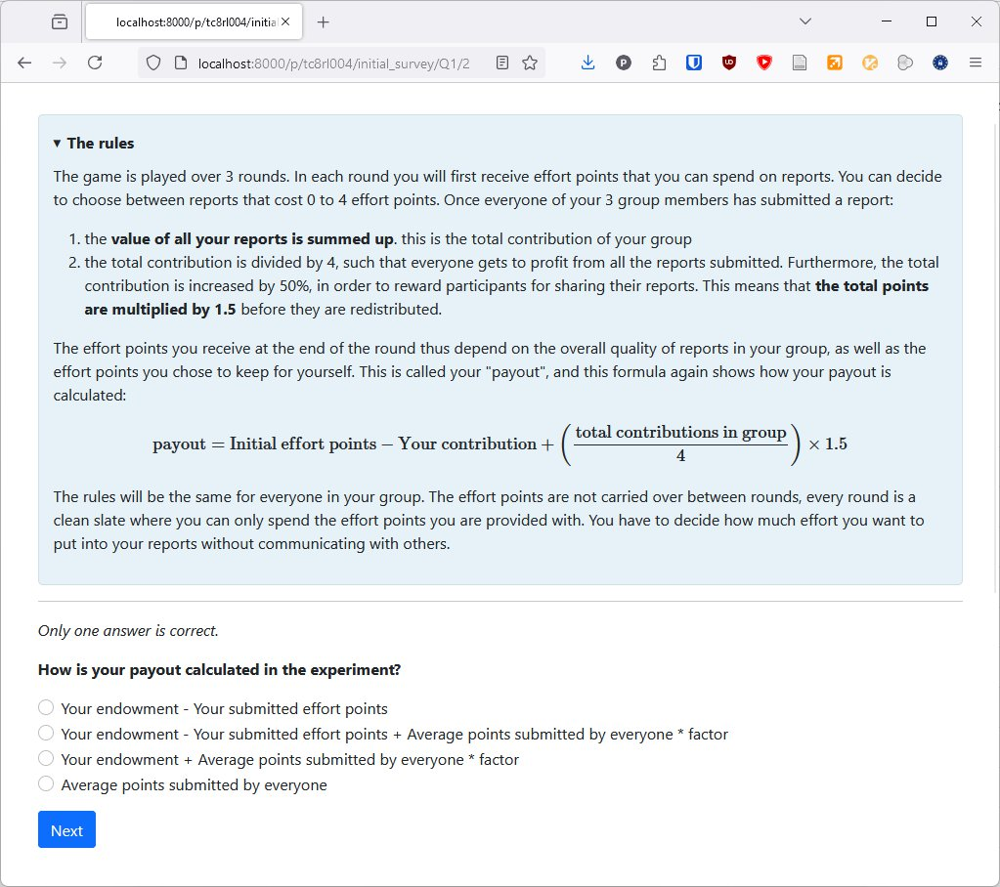
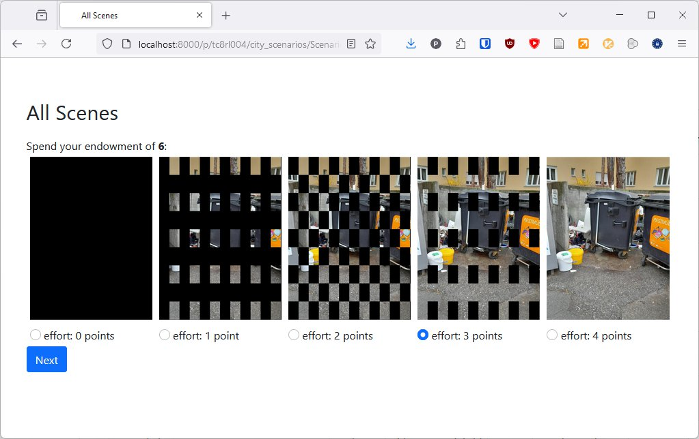

# About
During my Master's Degree, we had a social-sciences course in which we planned and executed a [public goods game](https://en.wikipedia.org/wiki/Public_goods_game).
Our professor encouraged us to use [otree](https://www.otree.org/) to set up our interactive experiment, and I implemented the game that we later hosted on a heroku server.
To be honest, I don't think our experiment made a lot of sense, but otree was fun to work with 🙃

## Some screenshots
Rules of the game:  

Choosing your contribution:  
